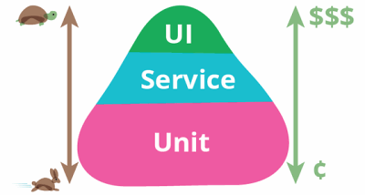

spring-test-x
======

The extension of 
[Spring TestContext Framework](http://docs.spring.io/spring/docs/current/spring-framework-reference/html/testing.html).

### 核心组件

#### 单元测试（[Unit testing - Wikipedia](https://en.wikipedia.org/wiki/Unit_testing)）
* [AbstractControllerTestngTest](/src/main/java/com/test/AbstractControllerTestngTest.java)

#### 集成测试（[Integration testing - Wikipedia](https://en.wikipedia.org/wiki/Integration_testing)）

### 代码示例

#### 单元测试
* [UserServiceJunitTest](/src/test/java/com/test/service/UserServiceJunitTest.java)
* [UserServiceTestngTest](/src/test/java/com/test/service/UserServiceTestngTest.java)
* [UserControllerTestngTest](/src/test/java/com/test/web/controller/UserControllerTestngTest.java)

#### 集成测试
* [UserControllerHttpApiTest](/src/test/java/com/test/web/controller/UserControllerHttpApiTest.java)

### 单元测试的价值
* 尽早在尽量小的范围内暴露错误，以最低的成本修复(尽早发现问题)
* 在著名的"测试金字塔"中，单元测试处于底层，相比上层的测试，单测运行快、成本低，更能指出问题所在并快速修复(bug fix)
（关于这一点可以延伸阅读下 [Google testing: Just Say No to More End-to-End Tests](https://testing.googleblog.com/2015/04/just-say-no-to-more-end-to-end-tests.html)）
* 前人种树后人乘凉，完善的单元测试有利于后面做重构，降低代码维护成本(适应变更、简化集成)
* 文档记录(表现程序单元成功的关键特点，可作为API使用示例)
* 表达设计/设计文档(每一个单元测试案例均可以视为一项类、方法和待观察行为等设计元素)
* 分离接口和实现
* **参数化数据驱动测试**使**测试代码**与**测试数据**完全独立，一组数据就是一个测试Case，代码结构简洁清晰

#### 如何正确认知测试金字塔
> http://www.51ste.com/share/det-5870.html

如果你还不了解测试金字塔，但是很关注质量和测试，那么不管你是什么角色，这篇文章也适合你。

**测试金字塔**最早由Mike Cohn提出，Martin Fowler在文章[《TestPyramid》](https://martinfowler.com/bliki/TestPyramid.html)中有详细介绍。如果你对测试金字塔不了解，可以先看Martin的文章。

总得说来，**测试金字塔是自动化测试分层覆盖情况的一个参考模型**，其特点是：
* 金字塔底层的测试是最接近代码的测试——单元测试，编写成本低、执行速度快、定位问题也更准确，但是离业务层较远，不能很好的体现业务价值；
* 金字塔顶层的测试是UI层的自动化测试，这一层离业务近，能够体现业务流程覆盖情况，但是编写成本较高、执行速度较慢、不够稳定、定位问题也更难；
* 而中间层的集成测试，则是成本和价值都是处于居中位置。

因此，金字塔建议底层单元测试占比应该最多，而顶层UI层测试占比较少，中间层的集成测试居中，整体呈现金字塔结构。

### 总结
* 从单元测试代码中可以清晰地看出，基于**TestNG**的**参数化数据驱动测试**明显要比基于JUnit的简单清晰。

### 参考资料
* [Unit testing - Wikipedia](https://en.wikipedia.org/wiki/Unit_testing)
* [单元测试 - 维基百科](https://zh.wikipedia.org/wiki/单元测试)
* [14. Unit Testing of Spring Framework](http://docs.spring.io/spring/docs/current/spring-framework-reference/html/unit-testing.html)
* [16. Further Resources of Spring Framework](http://docs.spring.io/spring/docs/current/spring-framework-reference/html/testing-resources.html)
* [Test Overview - SpringSide4](https://github.com/springside/springside4/wiki/Test-Overview)
* [TestNG - Wikipedia](https://en.wikipedia.org/wiki/TestNG)
* [TestNG documentation](http://testng.org/doc/documentation-main.html)
* [Mockito - Wikipedia](https://en.wikipedia.org/wiki/Mockito)
* [Mockito documentation](http://site.mockito.org/mockito/docs/current/org/mockito/Mockito.html)
* [Mockito FAQ](https://github.com/mockito/mockito/wiki/FAQ)
* [AssertJ](http://joel-costigliola.github.io/assertj/)
* [JUnit](http://junit.org): "A **programmer**-oriented testing framework for Java" (面向程序员)
* [关于单元测试的总结及思考](http://ju.outofmemory.cn/entry/321814)
* [写有价值的单元测试](https://yq.aliyun.com/articles/93804)
* [如何正确认知测试金字塔](https://www.51ste.com/share/det-5870.html)

